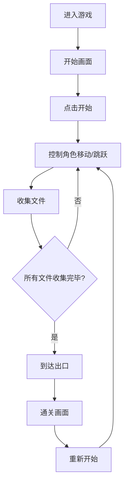

## 1. 产品概述
「梦境打工人」是一款手绘风格的 2D 横版平台跳跃小游戏。玩家扮演一个昏昏欲睡的打工人，在梦境般的办公室里穿梭，收集文件并冲向出口，在被老板发现前逃离工位。

- 核心玩法：左右移动 + 跳跃 + 平台碰撞 + 收集物品 + 到达终点
- 目标用户：喜欢轻松搞笑小游戏的上班族
- 产品价值：用幽默治愈的方式释放工作压力

## 2. 核心特性

### 2.1 角色与动画
| 状态 | 描述 |
|------|------|
| 站立 | 打工人眼皮打架，左右轻微摇晃，打瞌睡的样子 |
| 行走 | 两条小短腿交替迈动，身体随步伐上下起伏 |
| 跳跃 | 身体腾空，四肢张开呈「大」字，表情惊讶 |

### 2.2 游戏关卡
1. **办公室场景**：格子间、办公桌、文件柜作为平台
2. **收集物**：散落的文件（需全部收集才能通关）
3. **出口**：门口标志，到达后通关

### 2.3 页面详情
| 页面名称 | 模块名称 | 功能描述 |
|----------|----------|----------|
| 游戏主界面 | 开始画面 | 游戏标题、开始按钮、操作提示 |
| 游戏主界面 | 游戏画布 | Canvas 渲染的游戏场景 |
| 游戏主界面 | HUD 信息 | 已收集文件数、关卡提示 |
| 游戏主界面 | 胜利画面 | 通关提示、重新开始按钮 |

## 3. 核心流程
玩家进入游戏 → 点击开始 → 控制角色左右移动和跳跃 → 收集所有文件 → 到达出口 → 显示通关画面 → 可重新开始

## 4. 界面设计

### 4.1 设计风格
- **主色调**：温暖的米黄色背景 + 柔和的蓝粉色调（梦境感）
- **辅助色**：咖啡色（文件）、墨绿色（办公桌）、浅灰色（墙面）
- **按钮风格**：圆角矩形，手绘描边效果，带有轻微阴影
- **字体**：圆润可爱的手写体 / 卡通体
- **整体气质**：手绘涂鸦风，线条柔和，带一点点抖动摇晃的「梦感」

### 4.2 页面设计概览
| 页面名称 | 模块名称 | UI 元素 |
|----------|----------|---------|
| 游戏主界面 | 开始画面 | 大标题「梦境打工人」、打瞌睡的角色插画、「开始摸鱼」按钮、操作说明 |
| 游戏主界面 | 游戏画布 | 办公室背景、平台、文件道具、出口门、角色 |
| 游戏主界面 | HUD | 左上角文件计数、右上角小提示 |
| 游戏主界面 | 胜利画面 | 半透明遮罩、「下班啦！」标题、撒花特效、「再来一局」按钮 |

### 4.3 响应式
- 桌面端优先，Canvas 自适应窗口大小
- 支持键盘操作（方向键 / WASD + 空格跳跃）
- 移动端可考虑虚拟按键（MVP 版本暂不实现）

### 4.4 动画与动效
- 角色：待机呼吸动画、行走循环、跳跃姿势
- 背景：轻微的上下浮动（梦境漂浮感）
- 文件：缓慢旋转 + 上下漂浮
- 按钮：悬停放大、点击反馈
- 通关：彩带飘落、角色欢呼
