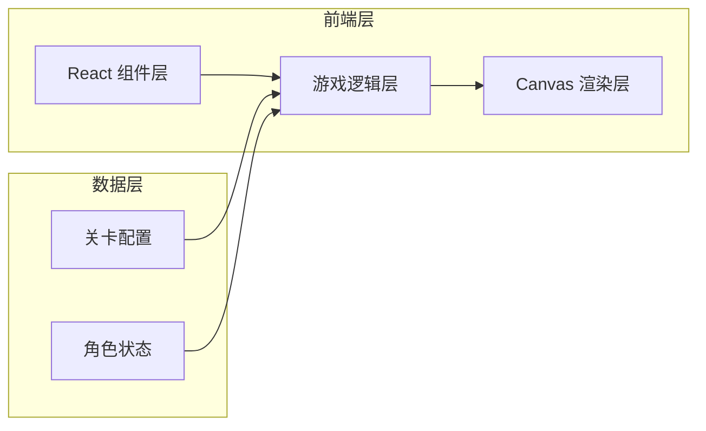

## 1. 架构设计



## 2. 技术选型
- **前端框架**：React@18 + TypeScript
- **构建工具**：Vite@5
- **样式方案**：TailwindCSS@3
- **游戏渲染**：HTML5 Canvas 2D
- **状态管理**：React useState / useRef（游戏内状态用 ref 避免重渲染）
- **物理系统**：自研简易物理引擎（重力、碰撞检测）

## 3. 目录结构
```
src/
├── components/         # React UI 组件
│   ├── GameCanvas.tsx  # 游戏画布组件
│   ├── StartScreen.tsx # 开始画面
│   ├── WinScreen.tsx   # 胜利画面
│   └── HUD.tsx         # 游戏内 HUD
├── game/               # 游戏核心逻辑
│   ├── types.ts        # 类型定义
│   ├── config.ts       # 游戏配置参数
│   ├── level.ts        # 关卡数据
│   ├── Player.ts       # 玩家角色类
│   ├── physics.ts      # 物理碰撞检测
│   └── renderer.ts     # Canvas 渲染器
├── hooks/              # 自定义 Hooks
│   └── useGameLoop.ts  # 游戏主循环 Hook
├── App.tsx             # 主应用组件
├── main.tsx            # 入口文件
└── index.css           # 全局样式
```

## 4. 核心模块说明

### 4.1 游戏主循环
- 使用 `requestAnimationFrame` 驱动
- 固定时间步长更新物理状态
- 每帧更新角色位置、检测碰撞、渲染画面

### 4.2 玩家角色
- 状态机：idle / walk / jump
- 属性：位置、速度、加速度、朝向
- 动画：基于时间的帧动画，手绘风格逐帧绘制

### 4.3 物理系统
- 重力加速度
- 平台碰撞检测（AABB）
- 跳跃：地面检测 + 初速度

### 4.4 渲染系统
- Canvas 2D 手绘风格绘制
- 角色使用路径绘制，模拟手绘线条抖动效果
- 背景分层绘制，营造空间感

## 5. 游戏状态定义
```typescript
type GameState = 'start' | 'playing' | 'win';

interface Player {
  x: number;
  y: number;
  vx: number;
  vy: number;
  width: number;
  height: number;
  facing: 'left' | 'right';
  state: 'idle' | 'walk' | 'jump';
  isGrounded: boolean;
}

interface Platform {
  x: number;
  y: number;
  width: number;
  height: number;
  type: 'desk' | 'cabinet' | 'floor';
}

interface Collectible {
  x: number;
  y: number;
  collected: boolean;
  rotation: number;
}
```

## 6. 操作方式
| 操作 | 按键 |
|------|------|
| 向左移动 | ← / A |
| 向右移动 | → / D |
| 跳跃 | 空格 / ↑ / W |
| 重新开始 | R（游戏结束后） |
